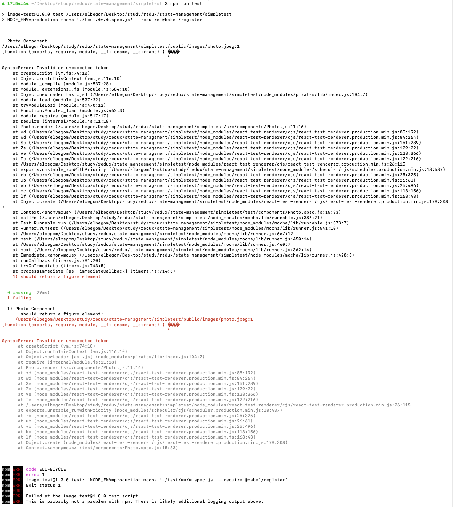

# Failing Mocha test for React component with image

This repo contains the setup for React component containing an image and which has a failing Mocha test.

The test can be run with

    npm run test

The program fails with a `SyntaxError: Invalid or unexpected token` and the actual test is never run. Below is a picture of the error output.

